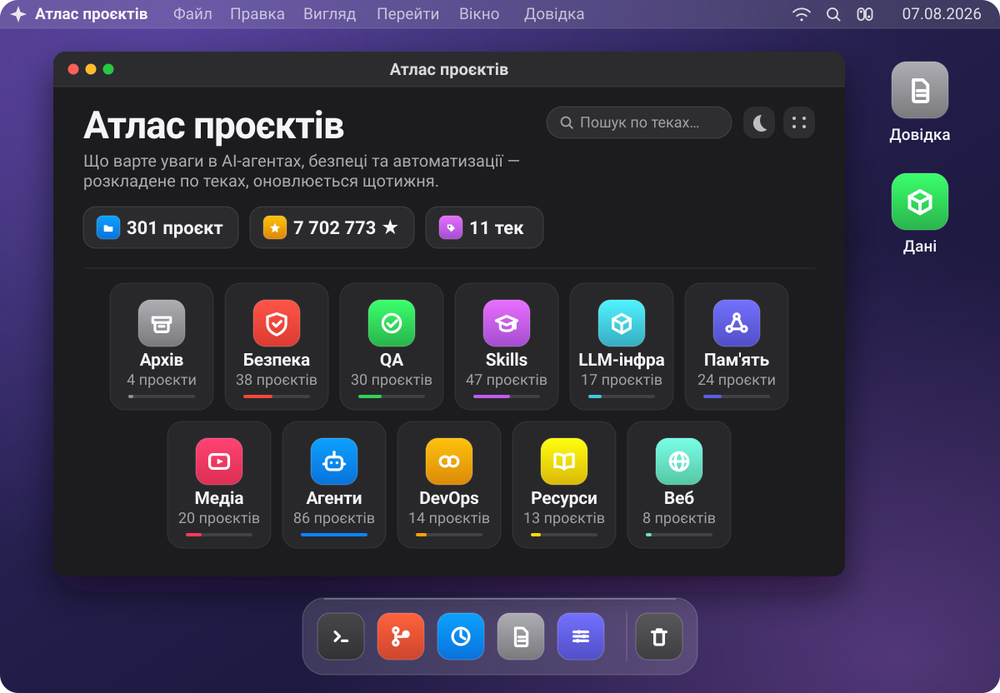
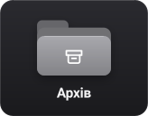
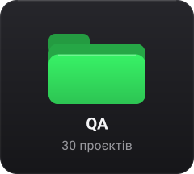
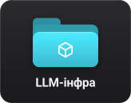
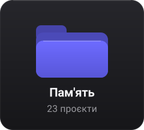
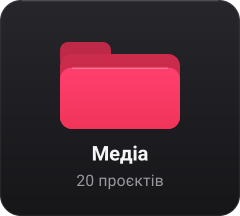
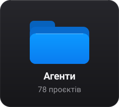
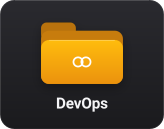
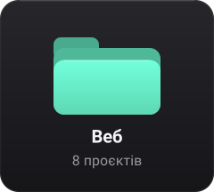

Каталог проєктів, за якими стежу. Більшість — форки (2); решта позначена 🔗. Розкладено по теках, оновлюється автоматично раз на тиждень.

<table>
  <tr>
    <td align="center" width="25%"></td>
    <td align="center" width="25%"></td>
    <td align="center" width="25%"></td>
    <td align="center" width="25%"></td>
  </tr>
  <tr>
    <td align="center" width="25%"></td>
    <td align="center" width="25%"></td>
    <td align="center" width="25%"></td>
    <td align="center" width="25%"></td>
  </tr>
  <tr>
    <td align="center" width="25%"></td>
    <td align="center" width="25%"></td>
    <td align="center" width="25%"></td>
  </tr>
</table>

**Швидкий перехід** · [Архів](docs/archive.md) 4 · [Безпека](docs/security.md) 39 · [QA](docs/qa.md) 30 · [Skills](docs/skills.md) 48 · [LLM-інфра](docs/llm-infra.md) 19 · [Пам'ять](docs/memory.md) 25 · [Медіа](docs/media.md) 26 · [Агенти](docs/agents.md) 87 · [DevOps](docs/devops.md) 14 · [Ресурси](docs/resources.md) 15 · [Веб](docs/web.md) 8

### Позначки

- 📋 — куративний список
- 🔗 — у форках немає — стежимо за оригіналом
- ⚠️ — оригінал заархівовано
- 💤 — оригінал без комітів понад рік

> Формат не є темою: awesome-список про безпеку лежить у теці безпеки з міткою 📋, а не в окремому списку списків. Тека відповідає на питання «про що це», мітка — «в якому це вигляді».

---

## Як це працює

`scripts/update.py` тягне список форків через GitHub GraphQL, додає проєкти з `scripts/extra.json` (ті, за якими стежимо без форку), розкладає все за правилами і перегенеровує цю сторінку, теки в `docs/` та `data/forks.json`. Правила й тексти категорій лежать у самому скрипті, ручні виправлення — у `scripts/overrides.json`.

`315 проєктів` · `8 498 050 ★ сумарно` · `11 тек` · `оновлено 24.08.2026`

Деталі, формат винятків і як додати категорію — у [docs/how-it-works.md](docs/how-it-works.md).
