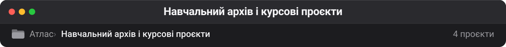

# Навчальний архів і курсові проєкти

Курсові приклади й чужі profile-README, збережені колись як зразок оформлення. Робочої цінності не мають, але видаляти їх — це стирати власну історію. Тримаються окремо, щоб не засмічувати активні категорії. Навчальних завдань GitHub Classroom тут немає: вони приватні, а каталог свідомо показує лише публічне.

| Проєкт | ★ | Мова | Що це |
| --- | --: | --- | --- |
| [dimashyshkin/advanced-selenium-webdriver](https://github.com/dimashyshkin/advanced-selenium-webdriver) 💤 | 43 | HTML | Code examples for Advanced Selenium Webdriver course on Udemy |
| [jamesgeorge007/jamesgeorge007](https://github.com/jamesgeorge007/jamesgeorge007) | 35 | — | 🙌 **— профільний README іншої людини — форкнуто як приклад оформлення** |
| [ShyamPraveenSingh/ShyamPraveenSingh](https://github.com/ShyamPraveenSingh/ShyamPraveenSingh) 💤 | 5 | — | — |
| [LumenRvenu/LumenRvenu](https://github.com/LumenRvenu/LumenRvenu) 💤 | 0 | — | Config files for my GitHub profile. |

---

**Інші теки** · [Безпека](security.md) · [QA](qa.md) · [Skills](skills.md) · [LLM-інфра](llm-infra.md) · [Пам'ять](memory.md) · [Медіа](media.md) · [Агенти](agents.md) · [DevOps](devops.md) · [Ресурси](resources.md) · [Веб](web.md)

[← На робочий стіл](../README.md)
