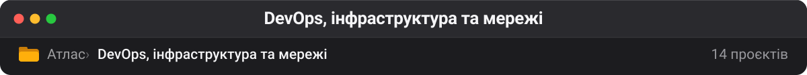

# DevOps, інфраструктура та мережі

Контейнери, Kubernetes, Terraform, мережеві утиліти й самохостинг. Помітно менший блок, ніж AI, і це чесно відображає зміщення фокусу: інфраструктурні форки здебільшого 2021–2024 років, тоді як AI-шар — останнього року.

| Проєкт | ★ | Мова | Що це |
| --- | --: | --- | --- |
| [ripienaar/free-for-dev](https://github.com/ripienaar/free-for-dev) 📋 | 131 410 | HTML | A list of SaaS, PaaS and IaaS offerings that have free tiers of interest to devops and infradev |
| [jdx/mise](https://github.com/jdx/mise) | 32 220 | Rust | dev tools, env vars, task runner **— заміна asdf/nvm/pyenv одним бінарником — керує і версіями інструментів, і env, і тасками** |
| [basecamp/omarchy](https://github.com/basecamp/omarchy) | 24 434 | Shell | Beautiful, Modern & Opinionated Linux |
| [milanm/DevOps-Roadmap](https://github.com/milanm/DevOps-Roadmap) | 20 199 | — | DevOps Roadmap for 2026. with learning resources |
| [sqshq/sampler](https://github.com/sqshq/sampler) 💤 | 14 731 | Go | Tool for shell commands execution, visualization and alerting. Configured with a simple YAML file. |
| [awesome-lists/awesome-bash](https://github.com/awesome-lists/awesome-bash) 📋 | 9 982 | Shell | A curated list of delightful Bash scripts and resources. |
| [remote-android/redroid-doc](https://github.com/remote-android/redroid-doc) | 6 673 | Shell | redroid (Remote-Android) is a multi-arch, GPU enabled, Android in Cloud solution. Track issues / docs here |
| [pshenok/server-survival](https://github.com/pshenok/server-survival) | 6 347 | JavaScript | Tower defense game that teaches cloud architecture. Build infrastructure, survive traffic, learn scaling. |
| [lissy93/networking-toolbox](https://github.com/lissy93/networking-toolbox) | 2 635 | Svelte | 🛜 100+ offline-first networking tools and utilities |
| [Manoj-engineer/k8squest](https://github.com/Manoj-engineer/k8squest) | 1 435 | Shell | K8sQuest — A local, hands-on Kubernetes learning game with real-world troubleshooting challenges. Practice Pods, Deployments, Services, networking, storage, and… |
| [karam-ajaj/atlas](https://github.com/karam-ajaj/atlas) | 1 300 | JavaScript | Open-source tool for network discovery, visualization, and monitoring. Built with Go, FastAPI, and React, supports Docker host scanning. |
| [AmineDjeghri/personal-os-setup](https://github.com/AmineDjeghri/personal-os-setup) | 599 | Python | An app and guide to easily configure Windows, Linux, MacOS, Google TV, Stremio, Home Assistant and more (including WSL2, GPU drivers & development tools). Improve… |
| [AlariCode/docker-demo](https://github.com/AlariCode/docker-demo) 💤 | 43 | TypeScript | — |
| [dimdimuzun/LearningTerraform](https://github.com/dimdimuzun/LearningTerraform) 💤 | 0 | HCL | — |

---

**Інші теки** · [Архів](archive.md) · [Безпека](security.md) · [QA](qa.md) · [Skills](skills.md) · [LLM-інфра](llm-infra.md) · [Пам'ять](memory.md) · [Медіа](media.md) · [Агенти](agents.md) · [Ресурси](resources.md) · [Веб](web.md)

[← На робочий стіл](../README.md)
