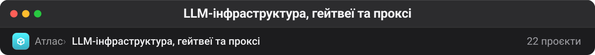

# LLM-інфраструктура, гейтвеї та проксі

Шар під агентами: сервери інференсу, маршрутизатори моделей, проксі для економії токенів і локальні голосові моделі. Це те, що визначає вартість і швидкість усього, що вище. Форки тут — переважно про незалежність від одного провайдера: гейтвеї на 200+ моделей, локальний STT/TTS, обхід rate limit.

| Проєкт | ★ | Мова | Що це |
| --- | --: | --- | --- |
| [vllm-project/vllm](https://github.com/vllm-project/vllm) | 87 592 | Python | A high-throughput and memory-efficient inference and serving engine for LLMs |
| [rtk-ai/rtk](https://github.com/rtk-ai/rtk) | 73 845 | Rust | CLI proxy that reduces LLM token consumption by 60-90% on common dev commands. Single Rust binary, zero dependencies |
| [headroomlabs-ai/headroom](https://github.com/headroomlabs-ai/headroom) | 63 198 | Python | Compress tool outputs, logs, files, and RAG chunks before they reach the LLM. 20% fewer tokens for coding agents, 60-95% fewer tokens for JSON, same answers.… |
| [microsoft/VibeVoice](https://github.com/microsoft/VibeVoice) | 51 201 | Python | Open-Source Frontier Voice AI |
| [router-for-me/CLIProxyAPI](https://github.com/router-for-me/CLIProxyAPI) | 45 495 | Go | Wrap Antigravity, ChatGPT Codex, Claude Code, Grok Build as an OpenAI/Gemini/Claude/Codex compatible API service, allowing you to enjoy the free Gemini 3.1 Pro, GPT… |
| [Alishahryar1/free-claude-code](https://github.com/Alishahryar1/free-claude-code) | 42 892 | Python | Use claude code, codex or pi for free from the terminal, IDE, or your phone like OpenClaw (voice supported) |
| [diegosouzapw/OmniRoute](https://github.com/diegosouzapw/OmniRoute) | 34 017 | TypeScript | Never stop coding. Free MIT AI gateway: one endpoint, 290+ providers (90+ free), 500+ models — Kimi, Claude, GPT, OpenAI, Gemini, GLM, DeepSeek, MiniMax. Works with… |
| [lbjlaq/Antigravity-Manager](https://github.com/lbjlaq/Antigravity-Manager) | 30 252 | Rust | Professional Antigravity Account Manager & Switcher. One-click seamless account switching for Antigravity Tools. Built with Tauri v2 + React (Rust).专业的 Antigravity… **— не просто перемикач акаунтів: під капотом проксі-шлюз диспетчеризації запитів до AI-провайдерів** |
| [cheahjs/free-llm-api-resources](https://github.com/cheahjs/free-llm-api-resources) 📋 | 28 663 | Python | A list of free LLM inference resources accessible via API. |
| [p-e-w/heretic](https://github.com/p-e-w/heretic) | 26 914 | Python | Fully automatic censorship removal for language models |
| [supertone-inc/supertonic](https://github.com/supertone-inc/supertonic) | 13 547 | Swift | Lightning-Fast, On-Device, Multilingual TTS — running natively via ONNX. |
| [altic-dev/FluidVoice](https://github.com/altic-dev/FluidVoice) | 9 102 | Swift | Fastest and only macOS Dictation app with on-device STT and custom trained AI enhancement model. A local Wispr Flow alternative. ⭐ helps a ton :) Windows & iOS… |
| [automazeio/vibeproxy](https://github.com/automazeio/vibeproxy) | 3 242 | Swift | Native macOS menu bar app to use your Claude Code & ChatGPT subscriptions with AI coding tools - no API keys needed |
| [liaohch3/claude-tap](https://github.com/liaohch3/claude-tap) | 2 905 | Python | Intercept and inspect Coding Agent API traffic from Claude Code, Codex CLI, Gemini CLI, Cursor CLI, OpenCode, Kimi/Kimi Code, Pi, and Hermes in a local trace viewer. |
| [superlinked/sie](https://github.com/superlinked/sie) | 2 360 | Python | Open-source inference server and production cluster for all the models your agent needs. |

---

**Інші теки** · [Архів](archive.md) · [Безпека](security.md) · [QA](qa.md) · [Skills](skills.md) · [Пам'ять](memory.md) · [Медіа](media.md) · [Агенти](agents.md) · [DevOps](devops.md) · [Ресурси](resources.md) · [Веб](web.md)

[← На робочий стіл](../README.md)
