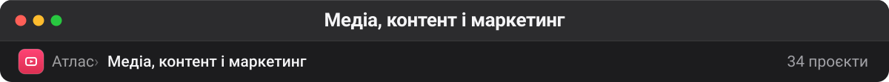

# Медіа, контент і маркетинг

Інструменти, що виробляють артефакт для людини, а не для рантайму: відео, презентації, діаграми, зображення, SEO-аналіз. Окрема категорія потрібна тому, що ці проєкти майже завжди агентні за реалізацією, але їхня цінність — у результаті, а не в архітектурі.

| Проєкт | Оригінал | ★ | Мова | Що це |
| --- | --- | --: | --- | --- |
| [microsoft/markitdown](https://github.com/microsoft/markitdown) 🔗 | — | 183 848 | Python | Python tool for converting files and office documents to Markdown. |
| [Comfy-Org/ComfyUI](https://github.com/Comfy-Org/ComfyUI) 🔗 | — | 133 031 | Python | The most powerful and modular diffusion model GUI, api and backend with a graph/nodes interface. **— diffusion GUI/API; topic ai тягне в агенти** |
| [harry0703/MoneyPrinterTurbo](https://github.com/harry0703/MoneyPrinterTurbo) 🔗 | — | 123 499 | Python | 利用 AI 大模型和自动化工作流，根据主题或关键词一键生成高清短视频。Generate HD short videos from a topic or keyword with an automated AI workflow. **— генерація коротких відео з AI-озвучкою; тема text-to-speech інакше тягне в LLM-інфру** |
| [nexu-io/open-design](https://github.com/nexu-io/open-design) 🔗 | — | 96 086 | TypeScript | 🎨 Best DeepSeek Harness Design Plugin. The open-source Claude Design alternative. 🖥️ Local-first desktop app. 🖼️ Your coding agent becomes the design engine:… |
| [OpenCut-app/OpenCut](https://github.com/OpenCut-app/OpenCut) 🔗 | — | 89 390 | TypeScript | The open-source CapCut alternative |
| [penpot/penpot](https://github.com/penpot/penpot) 🔗 | — | 59 978 | Clojure | Penpot: The open-source design platform for Product teams that need scalable collaboration. |
| [calesthio/OpenMontage](https://github.com/calesthio/OpenMontage) 🔗 | — | 58 950 | Python | World's first open-source, agentic video production system. 12 production pipelines, 100+ tools, 700+ agent skill and production-knowledge files. Turn your AI… |
| [hugohe3/ppt-master](https://github.com/hugohe3/ppt-master) 🔗 | — | 54 256 | Python | AI turns documents or topics into real, native PowerPoint decks—with native shapes, transitions and animations, data-backed charts and tables on demand, audio… |
| [heygen-com/hyperframes](https://github.com/heygen-com/hyperframes) 🔗 | — | 49 857 | TypeScript | Write HTML. Render video. Built for agents. |
| [siddharthvaddem/openscreen](https://github.com/siddharthvaddem/openscreen) 🔗⚠️ | — | 39 932 | TypeScript | Create stunning demos for free. Open-source, no subscriptions, no watermarks, and free for commercial use. An alternative to Screen Studio. |
| [Zackriya-Solutions/meetily](https://github.com/Zackriya-Solutions/meetily) 🔗 | — | 30 739 | Rust | Privacy first, AI meeting assistant with 4x faster Parakeet/Whisper live transcription, speaker diarization, and Ollama summarization built on Rust. 100% local… **— правила чіпляються за privacy first, але це транскрибування зустрічей** |
| [opendataloader-project/opendataloader-pdf](https://github.com/opendataloader-project/opendataloader-pdf) 🔗 | — | 29 172 | Java | PDF Parser for AI-ready data. Automate PDF accessibility. Open-source. |
| [webadderallorg/Recordly](https://github.com/webadderallorg/Recordly) 🔗 | — | 28 490 | TypeScript | Create polished demo videos without editing skills. Mac/Windows/Linux **— screen recorder для demo-відео; слово skills у описі збиває в skill-паки** |
| [bradautomates/claude-video](https://github.com/bradautomates/claude-video) 🔗 | — | 17 185 | Python | Give Claude the ability to watch any video. /watch downloads, extracts frames, transcribes, hands it all to Claude. |
| [deepbeepmeep/Wan2GP](https://github.com/deepbeepmeep/Wan2GP) 🔗 | — | 9 322 | Python | A fast AI Video Generator for the GPU Poor. Supports Wan 2.1/2.2, LTX-2, Qwen Image, Hunyuan Video, LTX Video and Flux. |
| [XiaoYouChR/Ghost-Downloader-3](https://github.com/XiaoYouChR/Ghost-Downloader-3) 🔗 | — | 9 027 | Python | The only downloader you need. 下载器的集大成者。 |
| [Vincentwei1021/video-shotcraft](https://github.com/Vincentwei1021/video-shotcraft) 🔗 | — | 8 516 | TypeScript | AI video skill for Claude Code & Codex — cinematic product videos with Remotion: 152 shot recipe cards, 209 motion previews, a production-ready template **— skill-пак, але артефакт — кінематографічне відео; skill у описі збиває в skill-паки** |
| [opentoonz/opentoonz](https://github.com/opentoonz/opentoonz) 🔗 | — | 7 723 | C++ | OpenToonz - An open-source full-featured 2D animation creation software |
| [persepolisdm/persepolis](https://github.com/persepolisdm/persepolis) 🔗 | — | 7 450 | Python | Persepolis is a download manager written in Python. |
| [lnkiai/m3e-canvas](https://github.com/lnkiai/m3e-canvas) 🔗 | — | 6 703 | TypeScript | Sketch Material 3 Expressive screens in the browser and turn them into vibe-coding prompts. |
| [Yqnn/svg-path-editor](https://github.com/Yqnn/svg-path-editor) 🔗 | — | 5 320 | TypeScript | Online editor to create and manipulate SVG paths |
| [oop7/YTSage](https://github.com/oop7/YTSage) 🔗 | — | 4 588 | Python | Modern YouTube downloader with a clean PySide6 interface. Download videos in any quality, extract audio, fetch subtitles, sponsorBlock, and view video metadata.… |
| [kane50613/takumi](https://github.com/kane50613/takumi) 🔗 | — | 2 984 | Rust | Render OG images and paged PDFs from JSX, HTML, and CSS. No headless browser. Runs on Node.js, Cloudflare Workers, browsers, and Rust. |
| [walterlow/freecut](https://github.com/walterlow/freecut) 🔗 | — | 2 170 | TypeScript | FreeCut is a professional-grade video editor that runs entirely in your browser. Professional video editing, zero installation. Create stunning videos with… |
| [kacperkapusciak/goldie](https://github.com/kacperkapusciak/goldie) 🔗 | — | 2 050 | TypeScript | ✨ agentic app store previews and screenshots **— генерує скріншоти й preview-відео для app store; написаний для coding-агентів, тому agentic тягне в агентів** |
| [perminder-klair/subwave](https://github.com/perminder-klair/subwave) 🔗 | — | 1 323 | TypeScript | Personal internet radio: Agentic AI DJ **— агентне за реалізацією, але артефакт — ефір: AI-діджей добирає треки й говорить між ними** |
| [techjarves/Uncensored-Local-Studio](https://github.com/techjarves/Uncensored-Local-Studio) 🔗 | — | 1 322 | JavaScript | Uncensored local AI studio for Windows, Linux, and macOS. Zero-setup GUI for Image Generation, GGUF LLMs, Text to Speech & Speech to Text |
| [kizuna-ai-lab/sokuji](https://github.com/kizuna-ai-lab/sokuji) 🔗 | — | 1 294 | TypeScript | Real-time two-way speech translation for bilingual meetings — auto-detects the spoken language and translates both directions, cloud or fully offline on-device.… |
| [Formsmith746/SketchForge-3D](https://github.com/Formsmith746/SketchForge-3D) 🔗 | — | 1 025 | TypeScript | A local-first browser 3D design editor for building, cutting, importing STL files, and exporting models. |
| [NathanRSmith/graphql-visualizer](https://github.com/NathanRSmith/graphql-visualizer) 🔗💤 | — | 198 | JavaScript | — |
| [CharlesHoskinson/anthropies](https://github.com/CharlesHoskinson/anthropies) 🔗 | — | 186 | TypeScript | Restore clean title in work you already own. Strip vendor marks from Outputs Anthropic assigned to you. **— прибирає vendor marks з уже власного контенту; anthropic у тексті збиває правила** |
| [AgriciDaniel/seo-os](https://github.com/AgriciDaniel/seo-os) 🔗 | — | 125 | TypeScript | SEO Office is a local-first SEO agency operating system. claw3d UI + claude-seo specialists + marketing-brain. Distributed as a private repo to a non-technical… |
| [orlovvugorivzai/ua-ultimate-humanizer-by-orlov](https://github.com/orlovvugorivzai/ua-ultimate-humanizer-by-orlov) 🔗 | — | 16 | — | Найпотужніший інструмент для гуманізації українських текстів будь-яких форматів (блоги, статті, технічна документація, README, маркетинг). **— гуманізатор українських текстів; README в описі тягне в ресурси** |
| [yuriiss/X-Forge-Factory](https://github.com/yuriiss/X-Forge-Factory) 🔗 | — | 5 | TypeScript | Self-hosted operator console for Magnific / Freepik AI. REST + MCP, 48 image models, 52 video models, credit-safe job engine |

---

**Інші теки** · [Архів](archive.md) · [Безпека](security.md) · [QA](qa.md) · [Skills](skills.md) · [LLM-інфра](llm-infra.md) · [Пам'ять](memory.md) · [Агенти](agents.md) · [DevOps](devops.md) · [Ресурси](resources.md) · [Веб](web.md)

[← На робочий стіл](../README.md)
