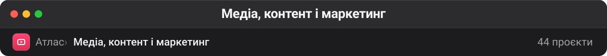

# Медіа, контент і маркетинг

Інструменти, що виробляють артефакт для людини, а не для рантайму: відео, презентації, діаграми, зображення, SEO-аналіз. Окрема категорія потрібна тому, що ці проєкти майже завжди агентні за реалізацією, але їхня цінність — у результаті, а не в архітектурі.

| Проєкт | Оригінал | ★ | Мова | Що це |
| --- | --- | --: | --- | --- |
| [microsoft/markitdown](https://github.com/microsoft/markitdown) 🔗 | — | 191 953 | Python | Python tool for converting files and office documents to Markdown. |
| [Comfy-Org/ComfyUI](https://github.com/Comfy-Org/ComfyUI) 🔗 | — | 142 589 | Python | The most powerful and modular diffusion model GUI, api and backend with a graph/nodes interface. The fastest local inference engine in the world. **— diffusion GUI/API; topic ai тягне в агенти** |
| [harry0703/MoneyPrinterTurbo](https://github.com/harry0703/MoneyPrinterTurbo) 🔗 | — | 134 824 | Python | 利用 AI 大模型和自动化工作流，根据主题或关键词一键生成高清短视频。Generate HD short videos from a topic or keyword with an automated AI workflow. **— генерація коротких відео з AI-озвучкою; тема text-to-speech інакше тягне в LLM-інфру** |
| [nexu-io/open-design](https://github.com/nexu-io/open-design) 🔗 | — | 103 742 | TypeScript | The 1st Collaborative AI Design Agent Workspace. Local-first and open source. Create motion, prototypes, websites, apps, dashboards, presentations, images, and… |
| [OpenCut-app/OpenCut](https://github.com/OpenCut-app/OpenCut) 🔗 | — | 96 005 | TypeScript | The open-source CapCut alternative |
| [debpalash/VoiceStudio](https://github.com/debpalash/VoiceStudio) 🔗 | — | 84 634 | Python | VoiceStudio is the open-source, fully-local ElevenLabs alternative — voice cloning, voice design, video dubbing, dictation, transcription & audiobook creation in… **— локальний ElevenLabs: клонування голосу, дубляж, аудіокниги; tts/stt тягнуть у LLM-інфру** |
| [storytold/photocraft](https://github.com/storytold/photocraft) 🔗 | — | 72 320 | Rust | PhotoCraft: An open-source, photo editor written by scratch in pure Rust **— open-source Photoshop на Rust; тема adobe-photoshop-2026-ai тягне в агенти** |
| [calesthio/OpenMontage](https://github.com/calesthio/OpenMontage) 🔗 | — | 71 526 | Python | World's first open-source, agentic video production system. 12 production pipelines, 100+ tools, 700+ agent skill and production-knowledge files. Turn your AI… |
| [heygen-com/hyperframes](https://github.com/heygen-com/hyperframes) 🔗 | — | 71 357 | TypeScript | Write HTML. Render video. Built for agents. |
| [hugohe3/ppt-master](https://github.com/hugohe3/ppt-master) 🔗 | — | 67 387 | Python | AI turns documents or topics into real, native PowerPoint decks—with native shapes, transitions and animations, data-backed charts and tables on demand, audio… |
| [penpot/penpot](https://github.com/penpot/penpot) 🔗 | — | 61 610 | Clojure | Penpot: The open-source design platform for Product teams that need scalable collaboration. |
| [siddharthvaddem/openscreen](https://github.com/siddharthvaddem/openscreen) 🔗⚠️ | — | 39 922 | TypeScript | Create stunning demos for free. Open-source, no subscriptions, no watermarks, and free for commercial use. An alternative to Screen Studio. |
| [storytold/artcraft](https://github.com/storytold/artcraft) 🔗 | — | 36 255 | Rust | ArtCraft is an intentional crafting engine for artists, designers, and filmmakers |
| [webadderallorg/Recordly](https://github.com/webadderallorg/Recordly) 🔗 | — | 35 051 | TypeScript | Create polished demo videos without editing skills. Mac/Windows/Linux **— screen recorder для demo-відео; слово skills у описі збиває в skill-паки** |
| [Zackriya-Solutions/meetily](https://github.com/Zackriya-Solutions/meetily) 🔗 | — | 32 121 | Rust | Privacy first, AI meeting assistant with 4x faster Parakeet/Whisper live transcription, speaker diarization, and Ollama summarization built on Rust. 100% local… **— правила чіпляються за privacy first, але це транскрибування зустрічей** |
| [opendataloader-project/opendataloader-pdf](https://github.com/opendataloader-project/opendataloader-pdf) 🔗 | — | 29 982 | Java | PDF Parser for AI-ready data. Automate PDF accessibility. Open-source. |
| [bradautomates/claude-video](https://github.com/bradautomates/claude-video) 🔗 | — | 19 154 | Python | Give Claude the ability to watch any video. /watch downloads, extracts frames, transcribes, hands it all to Claude. |
| [storytold/pdfcraft](https://github.com/storytold/pdfcraft) 🔗 | — | 17 609 | Rust | PdfCraft: An open-source PDF reader and editor written by scratch in pure Rust |
| [storytold/filmcraft](https://github.com/storytold/filmcraft) 🔗 | — | 16 046 | Rust | FilmCraft: An open-source, nonlinear video editor written by scratch in pure Rust |
| [storytold/lightcraft](https://github.com/storytold/lightcraft) 🔗 | — | 14 529 | Rust | LightCraft: An open-source non-destructive photo editor written by scratch in pure Rust |
| [Vincentwei1021/video-shotcraft](https://github.com/Vincentwei1021/video-shotcraft) 🔗 | — | 13 406 | TypeScript | AI video skill for Claude Code & Codex — cinematic product videos with Remotion: 152 shot recipe cards, 209 motion previews, a production-ready template **— skill-пак, але артефакт — кінематографічне відео; skill у описі збиває в skill-паки** |
| [deepbeepmeep/WanGP](https://github.com/deepbeepmeep/WanGP) 🔗 | — | 11 024 | Python | A fast AI Video Generator for the GPU Poor. Supports Minimax H3, LTX-2.3/2.5, Wan 2.1/2.2, Qwen Image 1/2, Krea 2, Hunyuan Video, LTX Video and Flux. |
| [storytold/vectorcraft](https://github.com/storytold/vectorcraft) 🔗 | — | 10 595 | Rust | VectorCraft: An open-source, vector art tool written by scratch in pure Rust |
| [XiaoYouChR/Ghost-Downloader-3](https://github.com/XiaoYouChR/Ghost-Downloader-3) 🔗 | — | 10 213 | Python | The only downloader you need. 下载器的集大成者。 |
| [zhouxiaoka/autoclip](https://github.com/zhouxiaoka/autoclip) 🔗 | — | 9 692 | Python | AutoClip｜一个链接，一键出片。开源 AI 视频剪辑桌面工具，将播客、访谈、课程等长视频自动剪成短视频，生成字幕、封面和发布文案，适配抖音、小红书、TikTok、Reels 与 YouTube Shorts。Open-source AI video clipping & content repurposing. |
| [lnkiai/m3e-canvas](https://github.com/lnkiai/m3e-canvas) 🔗 | — | 9 687 | TypeScript | Sketch Material 3 Expressive screens in the browser and turn them into vibe-coding prompts. |
| [opentoonz/opentoonz](https://github.com/opentoonz/opentoonz) 🔗 | — | 7 857 | C++ | OpenToonz - An open-source full-featured 2D animation creation software |
| [storytold/effectcraft](https://github.com/storytold/effectcraft) 🔗 | — | 7 833 | Rust | EffectCraft: An open-source motion graphics and compositing tool written by scratch in pure Rust **— частина open-source Adobe-сюїти storytold; без опису й тем** |
| [persepolisdm/persepolis](https://github.com/persepolisdm/persepolis) 🔗💤 | — | 7 480 | Python | Persepolis is a download manager written in Python. |
| [Yqnn/svg-path-editor](https://github.com/Yqnn/svg-path-editor) 🔗 | — | 5 340 | TypeScript | Online editor to create and manipulate SVG paths |
| [storytold/designcraft](https://github.com/storytold/designcraft) 🔗 | — | 4 743 | Rust | DesignCraft: An open-source page and layout design editor written by scratch in pure Rust **— частина open-source Adobe-сюїти storytold; без опису й тем** |
| [oop7/YTSage](https://github.com/oop7/YTSage) 🔗 | — | 4 694 | Python | Modern YouTube downloader with a clean PySide6 interface. Download videos in any quality, extract audio, fetch subtitles, sponsorBlock, and view video metadata.… |
| [kane50613/takumi](https://github.com/kane50613/takumi) 🔗 | — | 3 143 | Rust | Render OG images and paged PDFs from JSX, HTML, and CSS. No headless browser. Runs on Node.js, Cloudflare Workers, browsers, and Rust. |
| [FlashML-org/FreeVideo](https://github.com/FlashML-org/FreeVideo) 🔗 | — | 2 298 | Python | Make videos on the computer you already own. FreeVideo runs MiniMax H3 in as little as 8 GB of VRAM and 16 GB of RAM, and adapts its acceleration path to your… **— локальна генерація відео на власному залізі; слова про модель збивають у llm-infra** |
| [walterlow/freecut](https://github.com/walterlow/freecut) 🔗 | — | 2 289 | TypeScript | FreeCut is a professional-grade video editor that runs entirely in your browser. Professional video editing, zero installation. Create stunning videos with… |
| [westpoint-io/mimik](https://github.com/westpoint-io/mimik) 🔗 | — | 1 629 | TypeScript | 🪄 A browser extension that captures your workflow as you click and turns it into a step-by-step guide with annotated screenshots 📸 **— розширення: кліки → гайд зі скріншотами; privacy-first у темах тягне в безпеку** |
| [perminder-klair/subwave](https://github.com/perminder-klair/subwave) 🔗 | — | 1 446 | TypeScript | Personal internet radio: Agentic AI DJ **— агентне за реалізацією, але артефакт — ефір: AI-діджей добирає треки й говорить між ними** |
| [kizuna-ai-lab/sokuji](https://github.com/kizuna-ai-lab/sokuji) 🔗 | — | 1 430 | TypeScript | Real-time two-way speech translation for bilingual meetings — auto-detects the spoken language and translates both directions, cloud or fully offline on-device.… |
| [storytold/artcraft-services](https://github.com/storytold/artcraft-services) 🔗 | — | 1 295 | Rust | backend, web frontend, etc. **— бекенд/фронт сюїти ArtCraft; без тем правила не бачать** |
| [Formsmith746/SketchForge-3D](https://github.com/Formsmith746/SketchForge-3D) 🔗 | — | 1 169 | TypeScript | A local-first browser 3D design editor for building, cutting, importing STL files, and exporting models. |
| [stackblitz/bolt-slides](https://github.com/stackblitz/bolt-slides) 🔗 | — | 1 143 | TypeScript | Use any agent to create stunning, interactive presentations **— агентна генерація презентацій; слово agent у описі тягне в агенти** |
| [NathanRSmith/graphql-visualizer](https://github.com/NathanRSmith/graphql-visualizer) 🔗💤 | — | 197 | JavaScript | — |
| [CharlesHoskinson/anthropies](https://github.com/CharlesHoskinson/anthropies) 🔗 | — | 192 | TypeScript | Restore clean title in work you already own. Strip vendor marks from Outputs Anthropic assigned to you. **— прибирає vendor marks з уже власного контенту; anthropic у тексті збиває правила** |
| [storytold/photocraft-corpus](https://github.com/storytold/photocraft-corpus) 🔗 | — | 155 | JavaScript | Test data for photocraft **— тестові дані для photocraft; без тем правила не бачать** |
| [AgriciDaniel/seo-os](https://github.com/AgriciDaniel/seo-os) 🔗 | — | 144 | TypeScript | SEO Office is a local-first SEO agency operating system. claw3d UI + claude-seo specialists + marketing-brain. Distributed as a private repo to a non-technical… |
| [adityaarsharma/youtube-marketing-skills](https://github.com/adityaarsharma/youtube-marketing-skills) 🔗 | — | 68 | JavaScript | Open-source agent-agnostic YouTube growth toolkit — 21 AI commands + live channel MCP. Works with Claude Code, Cursor, Codex, Windsurf, Gemini CLI & any MCP client.… **— YouTube growth toolkit (SEO, Shorts, аналітика); слово skills у назві збиває в skill-паки** |
| [karem505/openclaw-agent-dashboard](https://github.com/karem505/openclaw-agent-dashboard) 🔗 | — | 47 | HTML | OpenClaw agent dashboard: glassmorphic UI to manage AI agents — task kanban, document editor, API monitoring and real-time agent tracking (HTML, CSS, JavaScript) |
| [MSKazemi/yazses](https://github.com/MSKazemi/yazses) 🔗 | — | 31 | Python | Free, open-source, fully-offline-by-default voice dictation for Linux (X11 & Wayland), macOS & Windows. Hold a key, speak, release — on-device faster-whisper types… **— офлайн-диктовка й транскрипція зустрічей; whisper/stt інакше тягнуть у LLM-інфру** |
| [orlovvugorivzai/ua-ultimate-humanizer-by-orlov](https://github.com/orlovvugorivzai/ua-ultimate-humanizer-by-orlov) 🔗 | — | 17 | — | Найпотужніший інструмент для гуманізації українських текстів будь-яких форматів (блоги, статті, технічна документація, README, маркетинг). **— гуманізатор українських текстів; README в описі тягне в ресурси** |
| [yuriiss/X-Forge-Factory](https://github.com/yuriiss/X-Forge-Factory) 🔗 | — | 7 | TypeScript | Self-hosted operator console for Magnific / Freepik AI. REST + MCP, 48 image models, 52 video models, credit-safe job engine |

---

**Інші теки** · [Архів](archive.md) · [Безпека](security.md) · [QA](qa.md) · [Skills](skills.md) · [LLM-інфра](llm-infra.md) · [Пам'ять](memory.md) · [Агенти](agents.md) · [DevOps](devops.md) · [Ресурси](resources.md) · [Веб](web.md)

[← На робочий стіл](../README.md)
