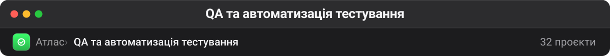

# QA та автоматизація тестування

Профільний блок: фреймворки, бойлерплейти й утиліти для e2e, API та мобільного тестування. Частина форків — робочі інструменти (Playwright, Appium, mokapi, k6), частина — навчальні репозиторії часів опанування Cypress. Другі позначені як сплячі, але лишаються як приклади еволюції підходів.

| Проєкт | Оригінал | ★ | Мова | Що це |
| --- | --- | --: | --- | --- |
| [promptfoo/promptfoo](https://github.com/promptfoo/promptfoo) 🔗 | — | 24 819 | TypeScript | Test your prompts, agents, and RAGs. Red teaming/pentesting/vulnerability scanning for AI. Compare performance of GPT, Claude, Gemini, DeepSeek, and more. Simple… **— правила відносять до безпеки через red teaming, але за суттю це тест-фреймворк для промптів** |
| [SonarSource/sonarqube](https://github.com/SonarSource/sonarqube) 🔗 | — | 10 951 | Java | Continuous Inspection |
| [AirtestProject/Airtest](https://github.com/AirtestProject/Airtest) 🔗 | — | 9 547 | Python | UI Automation Framework for Games and Apps |
| [Agents365-ai/drawio-skill](https://github.com/Agents365-ai/drawio-skill) 🔗 | — | 9 037 | Python | From text & real sources to maintainable .drawio architecture models: Diagram IR with source-kind profiles, incremental sync preserving manual layout, multi-view… |
| [refreshdotdev/web-eval-agent](https://github.com/refreshdotdev/web-eval-agent) 🔗⚠️ | — | 1 240 | Python | An MCP server that autonomously evaluates web applications. |
| [akshayp7/playwright-typescript-playwright-test](https://github.com/akshayp7/playwright-typescript-playwright-test) 🔗 | — | 730 | TypeScript | This is a boilerplate/template for a Playwright-Typescript framework for web UI, API, mobile emulation, DB, and visual testing. Docker image, SonarQube, Lighthouse,… |
| [AppiumTestDistribution/appium-device-farm](https://github.com/AppiumTestDistribution/appium-device-farm) 🔗 | — | 630 | TypeScript | This is an Appium 2.0 plugin designed to manage and create driver sessions on available devices. |
| [currents-dev/playwright-best-practices-skill](https://github.com/currents-dev/playwright-best-practices-skill) 🔗 | — | 373 | — | AI Skill for Playwright Best Practices—made by Currents.dev |
| [LambdaTest/agent-skills](https://github.com/LambdaTest/agent-skills) 🔗 | — | 366 | Python | AI agent skills for TestMu AI (Formerly LambdaTest). |
| [appclawhq/AppClaw](https://github.com/appclawhq/AppClaw) 🔗 | — | 110 | TypeScript | AI-powered mobile automation agent — describe what you want in plain English, AppClaw reads the screen, reasons, and acts. LLM-agnostic, open-source, zero telemetry. |
| [JoanEsquivel/cypress-cucumber-boilerplate](https://github.com/JoanEsquivel/cypress-cucumber-boilerplate) 🔗💤 | — | 109 | JavaScript | Cypress.IO Project using Javascript and Cucumber to start automating E2E tests just cloning it and installing dependencies. |
| [seontechnologies/playwright-utils](https://github.com/seontechnologies/playwright-utils) 📋🔗 | — | 109 | TypeScript | A collection of utilities for Playwright tests at SEON Technologies, designed to make testing more efficient and maintainable. |
| [bmad-code-org/bmad-method-test-architecture-enterprise](https://github.com/bmad-code-org/bmad-method-test-architecture-enterprise) 🔗 | — | 96 | JavaScript | Test Architect Full BMad Method Enhancement |
| [testomatio/explorbot](https://github.com/testomatio/explorbot) 🔗 | — | 73 | TypeScript | AI Agent for Exploratory Browser Testing |
| [marle3003/mokapi](https://github.com/marle3003/mokapi) 🔗 | — | 58 | Go | Your API mocking tool for OpenAPI and AsyncAPI using Go and JavaScript - https://mokapi.io **— мок OpenAPI/AsyncAPI; правила плутають через тему ldap** |
| [403-html/the-qa-architecture-handbook](https://github.com/403-html/the-qa-architecture-handbook) 🔗 | — | 18 | — | This guide provides a structured framework and practical advice for building a rock-solid, end-to-end QA architecture in an organization. |
| [deepakkamboj/playwright-ai-reporter](https://github.com/deepakkamboj/playwright-ai-reporter) 🔗 | — | 5 | TypeScript | Playwright AI Reporter is an enterprise-grade, production-ready test reporter that combines artificial intelligence with comprehensive test automation workflows. |
| [sherlock1982/wdio-selenoid-boilerplate](https://github.com/sherlock1982/wdio-selenoid-boilerplate) 🔗💤 | — | 4 | JavaScript | WebdriverIO 6 Selenoid boilerplate project with video support |
| [teosoph/cypress-cucumber___telnyx.com](https://github.com/teosoph/cypress-cucumber___telnyx.com) 🔗💤 | — | 2 | JavaScript | This is a tutorial project for learning the Cypress and Cucumber frameworks. |
| [YegorMaksymchuk/ai-testing-demo](https://github.com/YegorMaksymchuk/ai-testing-demo) 🔗💤 | — | 1 | — | Prototype for AI testing system |
| [Diankavoy19/Cypress-cucumber](https://github.com/Diankavoy19/Cypress-cucumber) 🔗💤 | — | 1 | HTML | — |
| [MichalFidor/playswag](https://github.com/MichalFidor/playswag) 🔗 | — | 1 | TypeScript | Playwright API coverage tracking against Swagger/OpenAPI specifications |
| [Cryzalis/Postman-newman-ghActions](https://github.com/Cryzalis/Postman-newman-ghActions) 🔗💤 | — | 1 | — | — |
| [yarikmuzyka/quiz](https://github.com/yarikmuzyka/quiz) 🔗 | — | 1 | CSS | — **— двомовний квіз для підготовки до співбесіди QA (844 питання, PWA); у оригіналі немає ні опису, ні тем** |
| [Cryzalis/cypress-telnyx.com](https://github.com/Cryzalis/cypress-telnyx.com) 🔗💤 | — | 0 | JavaScript | — |
| [Andrey-Pivtorak/Cypress_Cucumber](https://github.com/Andrey-Pivtorak/Cypress_Cucumber) 🔗💤 | — | 0 | JavaScript | The testing using cypress, cucumber, JavaScript, allure |
| [doktorgonza21/cypress_demo](https://github.com/doktorgonza21/cypress_demo) 🔗💤 | — | 0 | JavaScript | — |
| [cri-us/Cypress_Typescript_e2e](https://github.com/cri-us/Cypress_Typescript_e2e) 🔗💤 | — | 0 | TypeScript | — |
| [YegorMaksymchuk/k6-Grafana-InfluxDb-GitHubCopilot](https://github.com/YegorMaksymchuk/k6-Grafana-InfluxDb-GitHubCopilot) 🔗💤 | — | 0 | JavaScript | How to start with Performance testing with k6 and GitHub Copilot |
| [MichalFidor/playswag-examples](https://github.com/MichalFidor/playswag-examples) 🔗 | — | 0 | HTML | Real-world playswag API coverage examples — Swagger Petstore v3 with Playwright |
| [leraroy/playwright-ts](https://github.com/leraroy/playwright-ts) 🔗💤 | — | 0 | TypeScript | — |
| [Andrey-Pivtorak/PlayWrightProject](https://github.com/Andrey-Pivtorak/PlayWrightProject) 🔗💤 | — | 0 | TypeScript | — **— правила не бачать playwright у злитій назві PlayWrightProject — саме такі випадки й потрапляють у «Нерозібране»** |

---

**Інші теки** · [Архів](archive.md) · [Безпека](security.md) · [Skills](skills.md) · [LLM-інфра](llm-infra.md) · [Пам'ять](memory.md) · [Медіа](media.md) · [Агенти](agents.md) · [DevOps](devops.md) · [Ресурси](resources.md) · [Веб](web.md)

[← На робочий стіл](../README.md)
