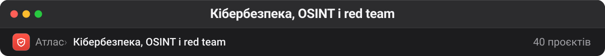

# Кібербезпека, OSINT і red team

Класичний інструментарій безпеки поруч з новою хвилею AI-пентестерів. Тут і фундамент, який працює десятиліттями (ghidra, mitmproxy, nuclei, SecLists), і автономні агенти, що намагаються цей фундамент замінити (strix, shannon, pentagi). Тримати їх разом корисно саме для порівняння: видно, що AI поки додає шар зверху, а не витісняє базові сканери.

| Проєкт | ★ | Мова | Що це |
| --- | --: | --- | --- |
| [danielmiessler/SecLists](https://github.com/danielmiessler/SecLists) 📋 | 72 720 | PHP | SecLists is the security tester's companion. It's a collection of multiple types of lists used during security assessments, collected in one place. List types… |
| [NationalSecurityAgency/ghidra](https://github.com/NationalSecurityAgency/ghidra) | 72 163 | Java | Ghidra is a software reverse engineering (SRE) framework |
| [usestrix/strix](https://github.com/usestrix/strix) | 50 431 | Python | Open-source AI penetration testing tool to find and fix your app’s vulnerabilities. |
| [KeygraphHQ/shannon](https://github.com/KeygraphHQ/shannon) | 46 584 | TypeScript | Shannon is an AI pentester for web applications and APIs. It analyzes your source code, identifies attack vectors, and executes real exploits to prove… |
| [mitmproxy/mitmproxy](https://github.com/mitmproxy/mitmproxy) | 44 630 | Python | An interactive TLS-capable intercepting HTTP proxy for penetration testers and software developers. |
| [projectdiscovery/nuclei](https://github.com/projectdiscovery/nuclei) | 30 404 | Go | Nuclei is a fast, customizable vulnerability scanner powered by the global security community and built on a simple YAML-based DSL, enabling collaboration to tackle… |
| [authelia/authelia](https://github.com/authelia/authelia) | 28 524 | Go | The Single Sign-On Multi-Factor portal for web apps, now OpenID Certified™ |
| [mukul975/Anthropic-Cybersecurity-Skills](https://github.com/mukul975/Anthropic-Cybersecurity-Skills) | 27 526 | Python | 817 structured cybersecurity skills for AI agents · Mapped to 6 frameworks: MITRE ATT&CK, NIST CSF 2.0, MITRE ATLAS, D3FEND, NIST AI RMF & MITRE F3 (Fight Fraud) ·… |
| [qeeqbox/social-analyzer](https://github.com/qeeqbox/social-analyzer) | 23 712 | JavaScript | API, CLI, and Web App for analyzing and finding a person's profile in 1000 social media \ websites |
| [zhaoxuya520/reverse-skill](https://github.com/zhaoxuya520/reverse-skill) | 22 821 | PowerShell | Reverse Engineering / Authorized Penetration Testing / Security Research Skill Router Pack AI-powered routing + On-demand toolchain bootstrapping + Self-evolving… |
| [vxcontrol/pentagi](https://github.com/vxcontrol/pentagi) | 21 736 | Go | Fully autonomous AI Agents system capable of performing complex penetration testing tasks |
| [farhanashrafdev/90DaysOfCyberSecurity](https://github.com/farhanashrafdev/90DaysOfCyberSecurity) | 18 298 | — | This repository contains a 90-day cybersecurity study plan, along with resources and materials for learning various cybersecurity concepts and technologies. The… |
| [NVIDIA/SkillSpector](https://github.com/NVIDIA/SkillSpector) | 14 442 | Python | Security scanner for AI agent skills. Detect vulnerabilities, malicious patterns, security risks, prompt injection, data exfiltration, and supply-chain risks in… |
| [awslabs/git-secrets](https://github.com/awslabs/git-secrets) | 13 367 | Shell | Prevents you from committing secrets and credentials into git repositories |
| [projectdiscovery/nuclei-templates](https://github.com/projectdiscovery/nuclei-templates) 📋 | 12 777 | JavaScript | Community curated list of templates for the nuclei engine to find security vulnerabilities. |
| [hslatman/awesome-threat-intelligence](https://github.com/hslatman/awesome-threat-intelligence) 📋 | 10 519 | — | A curated list of Awesome Threat Intelligence resources |
| [lissy93/awesome-privacy](https://github.com/lissy93/awesome-privacy) 📋 | 9 720 | Astro | 🦄 A curated list of privacy & security-focused software and services |
| [aliasrobotics/cai](https://github.com/aliasrobotics/cai) | 9 692 | Python | Cybersecurity AI (CAI), the framework for AI Security |
| [anchore/syft](https://github.com/anchore/syft) | 9 370 | Go | CLI tool and library for generating a Software Bill of Materials from container images and filesystems |
| [meirwah/awesome-incident-response](https://github.com/meirwah/awesome-incident-response) 📋 | 9 310 | — | A curated list of tools for incident response |
| [reddelexc/hackerone-reports](https://github.com/reddelexc/hackerone-reports) | 6 430 | Python | Top disclosed reports from HackerOne |
| [vavkamil/awesome-bugbounty-tools](https://github.com/vavkamil/awesome-bugbounty-tools) 📋 | 6 168 | — | A curated list of various bug bounty tools |
| [lanmaster53/recon-ng](https://github.com/lanmaster53/recon-ng) 💤 | 5 839 | Python | Open Source Intelligence gathering tool aimed at reducing the time spent harvesting information from open sources. |
| [onlurking/awesome-infosec](https://github.com/onlurking/awesome-infosec) 📋 | 5 715 | — | A curated list of awesome infosec courses and training resources. |
| [elder-plinius/T3MP3ST](https://github.com/elder-plinius/T3MP3ST) | 5 498 | TypeScript | autonomous red teaming platform; multi-agent offensive-security meta-harness |
| [ShadowHackrs/gmail-account-creator](https://github.com/ShadowHackrs/gmail-account-creator) | 4 231 | Python | 🚀 Advanced automated Gmail account creation tool with anti-detection, phone verification bypass, 5sim integration, and beautiful modern interface. Create Gmail… **— інструмент обходу антифроду; тут як зразок технік, а не для використання** |
| [gadievron/raptor](https://github.com/gadievron/raptor) | 3 545 | Python | Raptor turns Claude Code into a general-purpose AI offensive/defensive security agent. By using Claude.md and creating rules, sub-agents, and skills, and… |
| [kaifcodec/user-scanner](https://github.com/kaifcodec/user-scanner) | 3 083 | Python | 🕵️‍♂️ (2-in-1) Email & Username OSINT suite for deep data extraction just from a single Email/Username. Analyzes 375+ actively maintained scan vectors (150+ email /… |
| [lkarlslund/Adalanche](https://github.com/lkarlslund/Adalanche) | 2 192 | Go | Attack Graph Visualizer and Explorer (Active Directory) ...Who's *really* Domain Admin? |
| [iknowjason/Awesome-CloudSec-Labs](https://github.com/iknowjason/Awesome-CloudSec-Labs) 📋 | 2 166 | — | Awesome free cloud native security learning labs. Includes CTF, self-hosted workshops, guided vulnerability labs, and research labs. |
| [TheGP/untidetect-tools](https://github.com/TheGP/untidetect-tools) | 1 878 | — | List of anti-detect and humanizing tools and browsers, including captcha solvers and sms-activation. |
| [bugbasesecurity/pentest-copilot](https://github.com/bugbasesecurity/pentest-copilot) | 1 260 | TypeScript | Pentest Copilot is an AI-powered browser based ethical hacking assistant tool designed to streamline pentesting workflows. |
| [PaulJerimy/SecCertRoadmapHTML](https://github.com/PaulJerimy/SecCertRoadmapHTML) 💤 | 1 178 | HTML | Security Certification Roadmap HTML5/CSS3 version |
| [HadessCS/Red-team-Interview-Questions](https://github.com/HadessCS/Red-team-Interview-Questions) 💤 | 772 | — | Red team Interview Questions |
| [ubikron/Awesome-AI-OSINT](https://github.com/ubikron/Awesome-AI-OSINT) 📋 | 741 | — | A list of articles, videos, and tools related to the use of AI for OSINT. |
| [UndeadSec/SwaggerSpy](https://github.com/UndeadSec/SwaggerSpy) | 317 | Python | Automated OSINT on SwaggerHub |
| [RojanSapkota/osint-terminal](https://github.com/RojanSapkota/osint-terminal) | 30 | Python | Self-hosted OSINT dashboard: 400+ keyless recon tools, a live 3D threat globe, and batch/case investigation workflows, no API keys required. |
| [ProwlrBot/CyberBox](https://github.com/ProwlrBot/CyberBox) | 13 | Python | CyberSandbox — all-in-one Docker security workspace with 160+ tools, dual AI, Caido proxy, and plugin marketplace |

---

**Інші теки** · [Архів](archive.md) · [QA](qa.md) · [Skills](skills.md) · [LLM-інфра](llm-infra.md) · [Пам'ять](memory.md) · [Медіа](media.md) · [Агенти](agents.md) · [DevOps](devops.md) · [Ресурси](resources.md) · [Веб](web.md)

[← На робочий стіл](../README.md)
