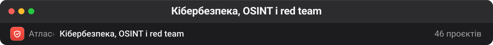

# Кібербезпека, OSINT і red team

Класичний інструментарій безпеки поруч з новою хвилею AI-пентестерів. Тут і фундамент, який працює десятиліттями (ghidra, mitmproxy, nuclei, SecLists), і автономні агенти, що намагаються цей фундамент замінити (strix, shannon, pentagi). Тримати їх разом корисно саме для порівняння: видно, що AI поки додає шар зверху, а не витісняє базові сканери.

| Проєкт | Оригінал | ★ | Мова | Що це |
| --- | --- | --: | --- | --- |
| [morluto/rea](https://github.com/morluto/rea) 🔗 | — | 377 616 | TypeScript | Reverse engineer anything with agents, from app behavior down to native binaries. |
| [NationalSecurityAgency/ghidra](https://github.com/NationalSecurityAgency/ghidra) 🔗 | — | 93 915 | Java | Ghidra is a software reverse engineering (SRE) framework |
| [danielmiessler/SecLists](https://github.com/danielmiessler/SecLists) 📋🔗 | — | 74 326 | PHP | SecLists is the security tester's companion. It's a collection of multiple types of lists used during security assessments, collected in one place. List types… |
| [usestrix/strix](https://github.com/usestrix/strix) 🔗 | — | 71 635 | Python | Open-source AI penetration testing tool to find and fix your app’s vulnerabilities. |
| [KeygraphHQ/shannon](https://github.com/KeygraphHQ/shannon) 🔗 | — | 49 311 | TypeScript | Shannon is an AI pentester for web applications and APIs. It analyzes your source code, identifies attack vectors, and executes real exploits to prove… |
| [mitmproxy/mitmproxy](https://github.com/mitmproxy/mitmproxy) 🔗 | — | 46 284 | Python | An interactive TLS-capable intercepting HTTP proxy for penetration testers and software developers. |
| [zhaoxuya520/reverse-skill](https://github.com/zhaoxuya520/reverse-skill) 🔗 | — | 43 214 | PowerShell | Reverse Engineering / Authorized Penetration Testing / Security Research Skill Router Pack AI-powered routing + On-demand toolchain bootstrapping + Self-evolving… |
| [tinyhumansai/openhuman](https://github.com/tinyhumansai/openhuman) 🔗 | — | 42 303 | Rust | The fastest, cheapest, most efficient open-source agent harness. Run more than 500 agents on a $10 VPS. |
| [mukul975/Anthropic-Cybersecurity-Skills](https://github.com/mukul975/Anthropic-Cybersecurity-Skills) 🔗 | — | 34 944 | Python | 817 structured cybersecurity skills for AI agents · Mapped to 6 frameworks: MITRE ATT&CK, NIST CSF 2.0, MITRE ATLAS, D3FEND, NIST AI RMF & MITRE F3 (Fight Fraud) ·… |
| [vxcontrol/pentagi](https://github.com/vxcontrol/pentagi) 🔗 | — | 32 288 | Go | Fully autonomous AI Agents system capable of performing complex penetration testing tasks |
| [projectdiscovery/nuclei](https://github.com/projectdiscovery/nuclei) 🔗 | — | 32 287 | Go | Nuclei is a fast, customizable vulnerability scanner powered by the global security community and built on a simple YAML-based DSL, enabling collaboration to tackle… |
| [authelia/authelia](https://github.com/authelia/authelia) 🔗 | — | 29 396 | Go | The Single Sign-On Multi-Factor portal for web apps. OpenID Certified™ and Post-Quantum Cryptography Ready. |
| [qeeqbox/social-analyzer](https://github.com/qeeqbox/social-analyzer) 🔗 | — | 24 366 | JavaScript | API, CLI, and Web App for analyzing and finding a person's profile in 1000 social media \ websites |
| [NVIDIA/SkillSpector](https://github.com/NVIDIA/SkillSpector) 🔗 | — | 21 241 | Python | Security scanner for AI agent skills. Detect vulnerabilities, malicious patterns, security risks, prompt injection, data exfiltration, and supply-chain risks in… |
| [farhanashrafdev/90DaysOfCyberSecurity](https://github.com/farhanashrafdev/90DaysOfCyberSecurity) 🔗 | — | 20 417 | — | This repository contains a 90-day cybersecurity study plan, along with resources and materials for learning various cybersecurity concepts and technologies. The… |
| [awslabs/git-secrets](https://github.com/awslabs/git-secrets) 🔗💤 | — | 13 417 | Shell | Prevents you from committing secrets and credentials into git repositories |
| [projectdiscovery/nuclei-templates](https://github.com/projectdiscovery/nuclei-templates) 📋🔗 | — | 13 214 | JavaScript | Community curated list of templates for the nuclei engine to find security vulnerabilities. |
| [hslatman/awesome-threat-intelligence](https://github.com/hslatman/awesome-threat-intelligence) 📋🔗 | — | 10 772 | — | A curated list of Awesome Threat Intelligence resources |
| [lissy93/awesome-privacy](https://github.com/lissy93/awesome-privacy) 📋🔗 | — | 10 011 | Astro | 🦄 A curated list of privacy & security-focused software and services |
| [reconurge/flowsint](https://github.com/reconurge/flowsint) 🔗 | — | 9 912 | TypeScript | A modern platform for visual, flexible, and extensible graph-based investigations. For cybersecurity analysts and investigators. |
| [aliasrobotics/cai](https://github.com/aliasrobotics/cai) 🔗⚠️ | — | 9 839 | Python | Cybersecurity AI (CAI), the framework for AI Security |
| [anchore/syft](https://github.com/anchore/syft) 🔗 | — | 9 743 | Go | CLI tool and library for generating a Software Bill of Materials from container images and filesystems |
| [meirwah/awesome-incident-response](https://github.com/meirwah/awesome-incident-response) 📋🔗 | — | 9 495 | — | A curated list of tools for incident response |
| [reddelexc/hackerone-reports](https://github.com/reddelexc/hackerone-reports) 🔗 | — | 6 627 | Python | Top disclosed reports from HackerOne |
| [elder-plinius/T3MP3ST](https://github.com/elder-plinius/T3MP3ST) 🔗 | — | 6 599 | TypeScript | autonomous red teaming platform; multi-agent offensive-security meta-harness |
| [vavkamil/awesome-bugbounty-tools](https://github.com/vavkamil/awesome-bugbounty-tools) 📋🔗 | — | 6 395 | — | A curated list of various bug bounty tools |
| [lanmaster53/recon-ng](https://github.com/lanmaster53/recon-ng) 🔗 | — | 6 017 | Python | Open Source Intelligence gathering tool aimed at reducing the time spent harvesting information from open sources. |
| [onlurking/awesome-infosec](https://github.com/onlurking/awesome-infosec) 📋🔗 | — | 5 766 | — | A curated list of awesome infosec courses and training resources. |
| [ShadowHackrs/gmail-account-creator](https://github.com/ShadowHackrs/gmail-account-creator) 🔗 | — | 5 712 | Python | 🚀 Advanced automated Gmail account creation tool with anti-detection, phone verification bypass, 5sim integration, and beautiful modern interface. Create Gmail… **— інструмент обходу антифроду; тут як зразок технік, а не для використання** |
| [kaifcodec/user-scanner](https://github.com/kaifcodec/user-scanner) 🔗 | — | 5 466 | Python | 🕵️‍♂️ (2-in-1) Email & Username OSINT suite featuring native MCP support for deep data extraction just from a single Email/Username. Analyzes 2720+ actively… |
| [elementalsouls/Claude-BugHunter](https://github.com/elementalsouls/Claude-BugHunter) 🔗 | — | 5 271 | Python | A Claude Code skill bundle for bug hunting and external red-team work - 82 skills, 15 slash commands, 681 disclosed-report patterns curated across 24 core… |
| [oritera/Cairn](https://github.com/oritera/Cairn) 🔗 | — | 4 466 | Python | Cairn is a general-purpose AI state-space search engine, validated first on autonomous penetration testing. Sometimes misspelled as Carin. |
| [gadievron/raptor](https://github.com/gadievron/raptor) 🔗 | — | 3 936 | Python | Raptor turns Claude Code into a general-purpose AI offensive/defensive security agent. By using Claude.md and creating rules, sub-agents, and skills, and… |
| [lkarlslund/Adalanche](https://github.com/lkarlslund/Adalanche) 🔗 | — | 2 216 | Go | Attack Graph Visualizer and Explorer (Active Directory) ...Who's *really* Domain Admin? |
| [iknowjason/Awesome-CloudSec-Labs](https://github.com/iknowjason/Awesome-CloudSec-Labs) 📋🔗💤 | — | 2 207 | — | Awesome free cloud native security learning labs. Includes CTF, self-hosted workshops, guided vulnerability labs, and research labs. |
| [TheGP/untidetect-tools](https://github.com/TheGP/untidetect-tools) 🔗 | — | 2 046 | — | List of anti-detect and humanizing tools and browsers, including captcha solvers and sms-activation. |
| [bugbasesecurity/pentest-copilot](https://github.com/bugbasesecurity/pentest-copilot) 🔗 | — | 1 536 | TypeScript | Pentest Copilot is an AI-powered browser based ethical hacking assistant tool designed to streamline pentesting workflows. |
| [PaulJerimy/SecCertRoadmapHTML](https://github.com/PaulJerimy/SecCertRoadmapHTML) 🔗💤 | — | 1 218 | HTML | Security Certification Roadmap HTML5/CSS3 version |
| [s0ld13rr/pentestcode](https://github.com/s0ld13rr/pentestcode) 🔗 | — | 883 | TypeScript | PentestCode - Multi-agent AI penetration testing system with persistent engagement state, strategic coordination, and parallel autonomous operations. |
| [ubikron/Awesome-AI-OSINT](https://github.com/ubikron/Awesome-AI-OSINT) 📋🔗 | — | 797 | — | A list of articles, videos, and tools related to the use of AI for OSINT. |
| [HadessCS/Red-team-Interview-Questions](https://github.com/HadessCS/Red-team-Interview-Questions) 🔗💤 | — | 778 | — | Red team Interview Questions |
| [mdpsec/bug-bounty-hunting-prompts](https://github.com/mdpsec/bug-bounty-hunting-prompts) 🔗 | — | 759 | — | Reusable prompts for a structured, evidence-first bug bounty hunting workflow |
| [UndeadSec/SwaggerSpy](https://github.com/UndeadSec/SwaggerSpy) 🔗 | — | 322 | Python | Automated OSINT on SwaggerHub |
| [RojanSapkota/osint-terminal](https://github.com/RojanSapkota/osint-terminal) 🔗 | — | 46 | Python | Self-hosted OSINT dashboard: 400+ keyless recon tools, a live 3D threat globe, and batch/case investigation workflows, no API keys required. |
| [luispacheco22/OpenBurp](https://github.com/luispacheco22/OpenBurp) 🔗 | — | 26 | Shell | Connect Claude Code and Codex with Burp Suite Professional for authorized security testing. |
| [ProwlrBot/CyberBox](https://github.com/ProwlrBot/CyberBox) 🔗 | — | 16 | Python | CyberSandbox — all-in-one Docker security workspace with 160+ tools, dual AI, Caido proxy, and plugin marketplace |

---

**Інші теки** · [Архів](archive.md) · [QA](qa.md) · [Skills](skills.md) · [LLM-інфра](llm-infra.md) · [Пам'ять](memory.md) · [Медіа](media.md) · [Агенти](agents.md) · [DevOps](devops.md) · [Ресурси](resources.md) · [Веб](web.md)

[← На робочий стіл](../README.md)
