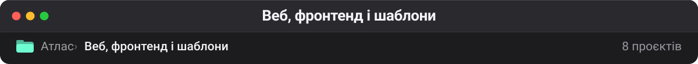

# Веб, фронтенд і шаблони

Стартові шаблони, генератори статичних сайтів і фронтенд-утиліти. Найстаріший шар колекції — здебільшого форки-заготовки, збережені «щоб було з чого почати», коли така потреба виникне.

| Проєкт | Оригінал | ★ | Мова | Що це |
| --- | --- | --: | --- | --- |
| [tw93/Pake](https://github.com/tw93/Pake) 🔗 | — | 61 279 | Rust | 🤱🏻 Turn any webpage into a desktop app with one command. |
| [CorentinTh/it-tools](https://github.com/CorentinTh/it-tools) 📋🔗 | — | 40 476 | Vue | Collection of handy online tools for developers, with great UX. |
| [birobirobiro/awesome-shadcn-ui](https://github.com/birobirobiro/awesome-shadcn-ui) 📋🔗 | — | 20 443 | TypeScript | A curated list of awesome things related to shadcn/ui. |
| [vladilenm/astro-cc](https://github.com/vladilenm/astro-cc) 🔗💤 | — | 8 | Astro | — |
| [andberry/berry-11ty](https://github.com/andberry/berry-11ty) 🔗💤 | — | 5 | SCSS | Eleventy (11ty) playground with multi-sections landing pages setup, and Frontend workflow (Scss, JS es6+) implemented with gulp |
| [ZennoHelpers/ZennoPoster-project-template](https://github.com/ZennoHelpers/ZennoPoster-project-template) 🔗⚠️💤 | — | 5 | C# | Проект ZennoPoster для IDE (C# и F#) |
| [mentorchita/my_yourname_site](https://github.com/mentorchita/my_yourname_site) 🔗 | — | 3 | SCSS | — |
| [isNan909/11tyblog-theme](https://github.com/isNan909/11tyblog-theme) 🔗💤 | — | 2 | Nunjucks | A Static site generator blog template made with 11ty. |

---

**Інші теки** · [Архів](archive.md) · [Безпека](security.md) · [QA](qa.md) · [Skills](skills.md) · [LLM-інфра](llm-infra.md) · [Пам'ять](memory.md) · [Медіа](media.md) · [Агенти](agents.md) · [DevOps](devops.md) · [Ресурси](resources.md)

[← На робочий стіл](../README.md)
